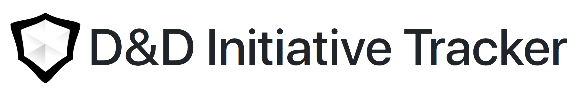

You can checkout the site [here](https://ejrbuss.net/dnd-initiative-tracker)!

## What is this?

This is a simple web application for Dungeon Masters to keep track of initiative order, monster health, and player statuses. It was built with input from [UltravioletVoodoo](https://github.com/UltravioletVoodoo).

## Help

Basic help

### Templates

Template help

### Command Language

The initiative tracker has a command bar that accepts some simple commands. This can be helpful for adjusting the tracker as well as doing quick D&D calculations.

The following commands are available:
|Command|Description|Examples|
|-|-|-|
|`#d#`|Roll some dice!|eg. `2d4`, `d20`|
|`# #`|Do some math!|eg. `4 * 5`, `3 + (d20 / 2)`, `max 7, 2d6`
|`hp±#`|Change the currently selected character's hit points.|eg.`hp-4`, `hp+12`|
|`jump`|Change to the currently selected character's turn.|eg. `jump`|
|`remove`|Remove the currnetly selected character from the initiative order.|eg. `remove`|
|`next/previous`|Move to the next/previous character in the initiative order.|eg. `next`, `previous`|
|`reset`|Reset the initiative order.|eg. `reset`|
|`reboot`|Clear the initiative order of all characters.|eg. `reboot`|
|`clear`|Clear the combat log.|eg. `clear`|
|`undo/redo`|Undo/redo the last action.|eg. `undo`, `redo`|
|`help`|Dispaly this help message.|eg. `help`|

## Build and Run Yourself

This is a simple static site. To build the site run
```bash
$ npm install
```
To install the dev dependencies, and then 
```bash
$ npm run dist
```
To build and open the weebsite.

## Contact

Feel free to send me bug reports or feature requests. If you are interested in my other work checkout my [website](https://ejrbuss.net). 

Email ejrbuss@gmail.com

Twitter [@ejrbuss](https://twitter.com/ejrbuss)